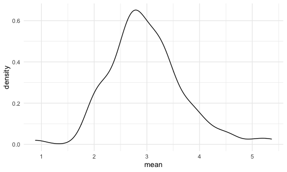
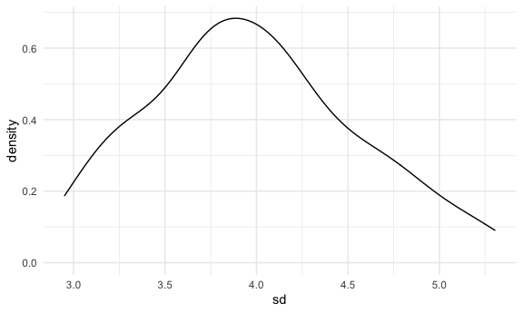

Simulation
================

``` r
sim_mean_sd = function(samp_size, mu = 3, sigma = 4) {
  
  sim_data =
    tibble(
      x = rnorm(n = samp_size, mean = mu, sd = sigma)
    )
  
  sim_data %>% 
    summarize(
      mean = mean(x),
      sd = sd(x)
    )

}
```

I can “simulate” by running this line.

``` r
sim_mean_sd(300000)
```

    ## # A tibble: 1 x 2
    ##    mean    sd
    ##   <dbl> <dbl>
    ## 1  2.99  3.99

## Let’s simulate a lot

Let’s start with a for loop

``` r
output = vector("list", length = 100)

for (i in 1:100) {
  
  output[[i]] = sim_mean_sd(samp_size = 30)
}

bind_rows(output)
```

    ## # A tibble: 100 x 2
    ##     mean    sd
    ##    <dbl> <dbl>
    ##  1  3.26  4.18
    ##  2  1.37  4.04
    ##  3  4.82  4.40
    ##  4  1.96  3.36
    ##  5  3.30  3.98
    ##  6  2.23  4.00
    ##  7  3.94  3.71
    ##  8  1.14  3.92
    ##  9  2.74  4.65
    ## 10  2.24  3.53
    ## # … with 90 more rows

Let’s use a loop function.

``` r
sim_results =
  rerun(100, sim_mean_sd(samp_size = 30)) %>% 
  bind_rows()
```

Let’s look at results…

``` r
sim_results %>% 
  ggplot(aes(x = mean)) + geom_density()
```



``` r
sim_results %>% 
  summarize(
    avg_sample_mean = mean(mean),
    sd_sample_mean = sd(mean)
  )
```

    ## # A tibble: 1 x 2
    ##   avg_sample_mean sd_sample_mean
    ##             <dbl>          <dbl>
    ## 1            2.98          0.706

``` r
sim_results %>% 
  ggplot(aes(x = sd)) + geom_density()
```



## Let’s try other sample sizes.

``` r
n_list = 
  list(
    "n = 30" = 30,
    "n = 60" = 60,
    "n = 120" = 120,
    "n = 240" = 240
  )

output = vector("list", length = 4)

output[[1]] = rerun(100, sim_mean_sd(samp_size = n_list[[1]])) %>% bind_rows

for(i in 1:4) {
  
  output[[i]] = rerun(100, sim_mean_sd(samp_size = n_list[[i]])) %>% 
    bind_rows()
}
```

``` r
sim_results =
tibble(
  sample_size = c(30, 60, 120, 240)
) %>% 
  mutate(
    output_lists = map(.x = sample_size, ~rerun(100, sim_mean_sd(.x))),
    estimate_df = map(output_lists, bind_rows)
  ) %>% 
  select(-output_lists) %>% 
  unnest(estimate_df)
```

Do some data frame things.

``` r
sim_results %>% 
  mutate(
    sample_size = str_c("n = ", sample_size),
    sample_size = fct_inorder(sample_size)
  ) %>% 
  ggplot(aes(x = sample_size, y = mean)) + 
  geom_boxplot()
```


``` r
sim_results %>%
  group_by(sample_size) %>% 
  summarize(
    avg_samp_mean = mean(mean),
    sd_samp_mean = sd(mean)
  )
```

    ## `summarise()` ungrouping output (override with `.groups` argument)

    ## # A tibble: 4 x 3
    ##   sample_size avg_samp_mean sd_samp_mean
    ##         <dbl>         <dbl>        <dbl>
    ## 1          30          3.08        0.681
    ## 2          60          3.10        0.478
    ## 3         120          3.04        0.388
    ## 4         240          2.99        0.291
